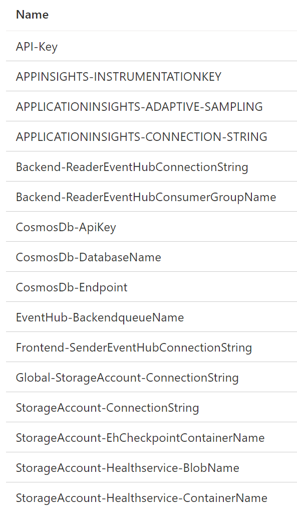
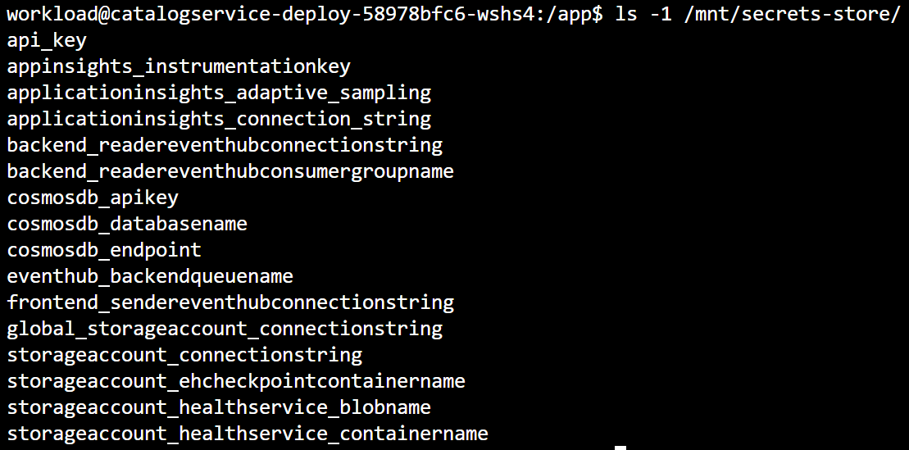

# Bring your own workload

The Azure Mission-Critical reference implementation follows a mono-repo approach hosting workload, infrastructure and supporting artifacts in a single repository. This is mainly done to make the reuse and maintenance as easy as possible. In a real-world environment (see [Brownfield considerations](./Brownfield-Considerations.md)) this can be different and the application code is often times separated from the infrastructure. In this guide we will describe the most common approaches to get existing workloads into the Azure Mission-Critical deployment.

- [Application Code](#application-code)
- [Kubernetes](#kubernetes-deployment)
- [Parameters](#parameters)

## Application Code

The simplest way to implement existing workloads is to continue with the **mono-repo** approach. New workloads including their source code can be added to the repo, and the existing pipelines can be extended to build, push and deploy it to the infrastructure.

In a **multi-repo** setup, the application code is stored in a different or in individual repositories, separated from each other and from the infrastructure. This also means that the application code is usually built and pushed in a separate pipeline.

The following two sub-sections contain information on how to either bring workloads via the mono-repo approach or via the multi-repo approach into the Azure Mission-Critical environment.

### Mono-repo

The application code is stored in the `/src/app/` directory. Each application has its own directory and contains a `Dockerfile` which is used to build the container image (for containerized workloads).

```bash
src/app/
├── <application1>
│   ├── Dockerfile
│   ├── ...
├── <application2>
│   ├── ...
```

This `Dockerfile` is picked up by the `Build Application Code` stage of the pipeline. This pipeline can be easily extended to build and push additional images to the Azure Container Registry.

The process itself is baked into a template that requires only three parameters:

```yaml
  - template: jobs-container-build.yaml
    parameters:
      jobName: '<app-name>' # unique pipeline job name
      containerImageName: '<container-image-name>' # container image name
      containerImageDockerFile: '<dockerfile>' # dockerfile used to build the container image
```

The `jobs-container-build.yaml` template expects the files to be stored in `/src/app/`. The `containerImageDockerFile` parameter specifies the relative path from there to the `Dockerfile` i.e. `application1\Dockerfile`. This can be overwritten by the `workingDirectory` parameter if needed.

### Multi-repo

The main consideration here is to which registry the container images are pushed e.g. to a corporate-wide central container registry (see [Brownfield considerations](./Brownfield-Considerations.md)) or following the Azure Mission-Critical recommendation into a solution-specific one and how they can be accessed and pulled to the clusters we're deploying here.

Other options are to push container images to the Azure Container Registry deployed as part of the Azure Mission-Critical reference implementation, or to import images from another registry into the Azure Mission-Critical environment. See [Brownfield considerations](./Brownfield-Considerations.md#Existing-container-registry) for more information.

## Kubernetes deployment

Assuming that we have our container images built and pushed to a container registry, the next step is to deploy the workload to each of our Kubernetes clusters in each of the regional deployment stamps.

The Azure Mission-Critical reference implementation uses [Helm](http://helm.sh) to package Kubernetes manifests and deploy them. The application-specific Helm charts are stored in `/src/app/charts`. These charts are currently not pushed to a container registry, they are applied directly from the repository as part of the deployment pipeline.

Depending on the type of environment, using the [mono-repo](#mono-repo) or [multi-repo](#multi-repo) approach, these Helm charts might exist outside of the infrastructure repository as well either in another repo or pushed to a container registry.

To deploy them into the Azure Mission-Critical environment, the `jobs-workload-deploy.yaml` template that contains individual tasks to deploy workloads to the clusters, needs to be extended.

## Parameters

When deploying workload components to the Azure Mission-Critical environment, some components might require additional parameters, like connection strings or other environment variables. These values are neither configured nor touched manually, they are all set and rotated automatically and extracted from the infrastructure deployment.

The deployment of the global as well as of the regional components export all relevant, non-sensitive settings:


These settings are available as variables in subsequent stages of the pipeline and can be used as parameters when deploying Helm charts.

Sensitive settings and secrets are automatically stored and updated in Azure Key Vault:



They are mounted from there directly into the containers via the Azure KeyVault CSI driver.



---

[Azure Mission-Critical - Full List of Documentation](/docs/README.md)
